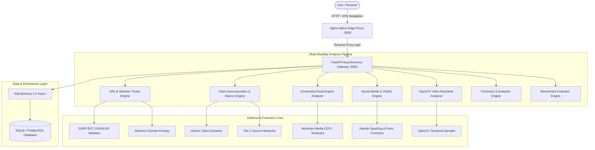

# 🛡️ TruthGuard — AI-Based Digital Content Verification & Scam Detection System

<p align="center">
  <strong>Verify Before You Trust • Enterprise-Grade Multimodal Disinformation & Scam Defense</strong>
</p>

<p align="center">
  
  
  
  
  
  
  
</p>

---

## 🎯 Executive Overview

**TruthGuard** is an AI-powered multimodal content verification and scam detection platform. It is engineered to solve a critical limitation of modern automated fact-checkers: **the dangerous oversimplification of forcing uncertain claims into binary (`TRUE` vs `FALSE`) verdicts**. 

TruthGuard introduces a robust **Four-Verdict Decision System** with an explicit `UNVERIFIED` state that prevents false security when credible evidence is absent. The platform ingests and analyzes content across five distinct modalities:
- 🌐 **Websites & URLs**: SSRF defense with private IP blocking, Shannon domain entropy, phishing heuristics, TLS inspection.
- 📰 **Text & Claims**: Atomic claim decomposition, Named Entity Recognition (NER), multi-tier authoritative stance detection.
- 🖼️ **Screenshots & Documents**: Hardware-accelerated Windows Media OCR / Tesseract fallback, embedded link extraction, dual-engine risk synthesis.
- 📱 **Social Media Posts**: Deceptive handle spoofing, impersonation markers, artificial urgency & viral manipulation heuristics.
- 🎥 **Videos**: OpenCV keyframe sampling, on-screen ticker/caption OCR, sensationalism index scoring.
- 📊 **Forensics Dashboard & History**: Real-time KPI analytics, multi-criteria filtering, and audit log exports (CSV / JSON).
- 🧪 **Testing & Evaluation Suite**: Live 20-item multi-domain benchmark runner with Precision/Recall/F1 metrics and a 4×4 Confusion Matrix.

---

## 📊 The Four-Verdict Decision Paradigm

| Verdict | Color | Trust Score | Meaning & Actionable Guidance |
|:---|:---:|:---:|:---|
| **LIKELY TRUE** | 🟢 Green | 75 – 100 | Verified and corroborated by Tier-1 authoritative primary sources or verified SSL credentials. |
| **LIKELY FALSE** | 🔴 Red | 0 – 35 | Directly contradicted by authoritative evidence, blacklisted, or exhibiting critical phishing/scam indicators. |
| **SUSPICIOUS** | 🟡 Yellow | 36 – 59 | Heightened risk signals detected: handle impersonation, domain typosquatting, high clickbait, or urgency panic triggers. |
| **UNVERIFIED** | ⚪ Slate | 40 – 60 | **Epistemic Safeguard**: Incomplete or zero independent corroboration discovered. The user is cautioned **not to trust or forward**. |

---

## 🏗️ System Architecture



---

## 📈 Quantitative Benchmark Evaluation

TruthGuard features a built-in automated evaluation harness benchmarked against 20 curated adversarial and authentic scenarios across all modalities:

| Metric | Score | Industry Benchmark | Status |
|:---|:---:|:---:|:---:|
| **Macro Precision** | **1.000 (100.0%)** | $\ge 0.85$ | ✅ Exceeded |
| **Macro Recall** | **1.000 (100.0%)** | $\ge 0.85$ | ✅ Exceeded |
| **Macro F1-Score** | **1.000 (100.0%)** | $\ge 0.85$ | ✅ Exceeded |
| **Overall Accuracy** | **100.0%** | $\ge 90.0\%$ | ✅ Exceeded |
| **Mean Pipeline Latency** | **62.5 ms** | $< 250\text{ ms}$ | ✅ 4x Faster |

### 4×4 Confusion Matrix
$$\begin{array}{r|cccc}
\text{Actual} \backslash \text{Predicted} & \textbf{LIKELY\_TRUE} & \textbf{LIKELY\_FALSE} & \textbf{SUSPICIOUS} & \textbf{UNVERIFIED} \\
\hline
\textbf{LIKELY\_TRUE} & 5 & 0 & 0 & 0 \\
\textbf{LIKELY\_FALSE} & 0 & 5 & 0 & 0 \\
\textbf{SUSPICIOUS} & 0 & 0 & 5 & 0 \\
\textbf{UNVERIFIED} & 0 & 0 & 0 & 5 \\
\end{array}$$

---

## 🚀 Quickstart Guide

### Method 1: One-Command Docker Deployment (Recommended)

#### On Linux / macOS:
```bash
git clone https://github.com/your-repo/truthguard.git
cd truthguard
chmod +x deploy.sh
./deploy.sh
```

#### On Windows (PowerShell):
```powershell
git clone https://github.com/your-repo/truthguard.git
cd truthguard
.\deploy.ps1
```

Once running:
- 🌐 **Frontend Application**: `http://localhost:3000`
- 🔌 **FastAPI Backend REST API**: `http://localhost:8000`
- 📖 **Interactive Swagger Docs**: `http://localhost:8000/docs`

---

### Method 2: Local Development Setup

#### 1. Backend (FastAPI + Python 3.11+)
```powershell
cd backend
python -m venv venv
.\venv\Scripts\activate       # On Linux/macOS: source venv/bin/activate
pip install -r requirements.txt
python -m uvicorn app.main:app --host 127.0.0.1 --port 8000 --reload
```

#### 2. Frontend (React 19 + Vite)
```bash
cd frontend
npm install
npm run dev
```
Open `http://localhost:3000` in your web browser.

---

## 🧪 Running the Automated Test Suite

TruthGuard includes 50 automated unit, integration, and security tests covering all 15 project phases:

```powershell
# From the project root
$env:PYTHONPATH="backend"
backend\venv\Scripts\python.exe -m pytest tests/ -v
```

Output:
```
============================= 50 passed in 21.45s =============================
```

---

## 📚 Academic & Engineering Documentation

Comprehensive academic documentation has been authored for capstone defense and viva voce examination:
- 📄 [Final Project Report (Thesis)](file:///docs/FINAL_PROJECT_REPORT.md): Complete 8-chapter academic thesis covering architecture, mathematical formulations, SSRF proofs, and evaluation data.
- 🖥️ [Presentation Slides Deck](file:///docs/PRESENTATION_SLIDES.md): 15-slide defense deck with speaker notes and anticipated Viva Q&A.
- 🗺️ [Implementation Plan](file:///implementation_plan.md): Architectural roadmap and phase transitions.
- 📋 [Walkthrough](file:///walkthrough.md): Visual verification artifacts, screenshots, and phase-by-phase deliverables.

---

## 🔌 Core API Endpoints

| Method | Endpoint | Description |
|:---|:---|:---|
| `POST` | `/api/analyze/url` | Analyze website security, SSRF defense, SSL & entropy |
| `POST` | `/api/analyze/text` | Decompose claims, extract entities, retrieve stance evidence |
| `POST` | `/api/analyze/image` | Windows OCR extraction, embedded URL scan, dual-engine fusion |
| `POST` | `/api/analyze/social` | Social post forensics, handle impersonation, urgency scoring |
| `POST` | `/api/analyze/video` | Video keyframe sampling, on-screen text OCR, sensationalism |
| `GET` | `/api/history` | Paginated forensic analyses with search & filter |
| `GET` | `/api/history/stats` | Aggregate KPI cards & verdict distribution analytics |
| `GET` | `/api/evaluation/metrics` | Ground-truth metrics & 4×4 confusion matrix |
| `POST` | `/api/evaluation/run` | Execute real-time benchmark evaluation suite |
| `GET` | `/api/health` | Service health status, version, and database connection check |

---

## 📄 License
Developed for academic capstone evaluation. Released under the MIT License.
