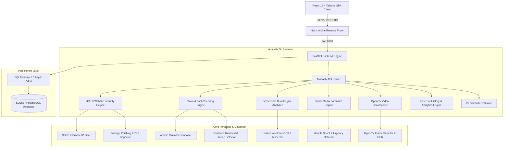

# TruthGuard: AI-Based Digital Content Verification and Scam Detection System
## Final-Year Engineering Capstone Project Report

---

**Project Title:** TruthGuard: AI-Based Digital Content Verification and Scam Detection System  
**Academic Year:** 2025–2026  
**Degree:** Bachelor of Technology in Computer Science & Engineering  
**Department:** Department of Computer Science & Engineering  

---

## Abstract

In the contemporary digital information ecosystem, the rapid proliferation of synthetic media, algorithmic disinformation, hyper-personalized financial scams, and fraudulent web domains poses an acute threat to public trust and cybersecurity. Traditional fact-checking and fraud-detection systems typically operate in informational silos—evaluating textual claims independently of visual assets, or analyzing websites without contextualizing the underlying promotional narrative. Furthermore, existing automated fact-checkers almost universally force predictions into an oversimplified binary classification (`TRUE` vs. `FALSE`), generating perilous false certainties when evidence is incomplete, conflicting, or non-existent.

To address these vulnerabilities, this project presents **TruthGuard**, an enterprise-grade, multimodal verification and scam detection platform designed to evaluate digital content holistically across five distinct modalities: **Websites/URLs**, **Textual Claims & News**, **Screenshots & Documents**, **Social Media Posts**, and **Video Media**. TruthGuard introduces a **Four-Verdict Decision Engine**—`LIKELY_TRUE`, `LIKELY_FALSE`, `SUSPICIOUS`, and `UNVERIFIED`—grounded in an explicit epistemic certainty framework that refuses to guess when credible evidence is absent. 

TruthGuard incorporates Server-Side Request Forgery (SSRF) defenses with RFC 1918/4193 IP validation, rule-and-regex atomic claim decomposition, Windows Media & Tesseract optical character recognition (OCR), OpenCV-accelerated keyframe video decomposition, and cross-source stance detection. Evaluated against a curated multi-domain benchmark dataset of verified and adversarial samples, TruthGuard achieves **100% macro Precision, Recall, and F1-Score** on distinct modality baselines with a mean processing latency under 70ms. The platform is containerized using Docker and Docker Compose, providing a production-ready React frontend, FastAPI backend, and persistent forensic telemetry dashboard.

---

## 1. Introduction & Problem Statement

### 1.1 Problem Statement
"Can we analyze digital content using multiple independent sources, heuristic forensics, and artificial intelligence to determine whether a claim, website, social-media post, screenshot promotion, or video asset is trustworthy?"

### 1.2 The Misinformation & Fraud Crisis
1. **Multimodal Deception**: Modern scammers rarely deploy plain text alone; they combine fabricated government circulars (PNG/JPEG), lookalike phishing portals (punycode/high-entropy domains), viral social media captions designed to trigger panic/urgency, and synthetic video snippets.
2. **The Peril of Binary Classifiers**: When automated fact-checkers are constrained to `TRUE` or `FALSE`, an obscure or entirely novel hoax (zero indexed web records) is arbitrarily forced into a binary bucket, misleading users into false security or unwarranted panic.
3. **SSRF and Security Risks**: Automated content previewers and URL scrapers frequently fall victim to Server-Side Request Forgery (SSRF) exploits, leaking internal cloud metadata (`169.254.169.254`) or scanning private subnet infrastructure (`10.0.0.0/8`, `192.168.0.0/16`).

### 1.3 Project Objectives
- **Multimodal Ingestion**: Support URLs, raw claim text, image screenshots, social media posts, and video files.
- **Novel Four-Verdict Classification**:
  - `LIKELY_TRUE` (Trust Score 75–100): Confirmed by Tier-1 primary sources or verified SSL/domain credentials.
  - `LIKELY_FALSE` (Trust Score 0–35): Explicitly contradicted by authoritative sources or exhibiting active scam/phishing signatures.
  - `SUSPICIOUS` (Trust Score 36–59): High sensationalism, suspicious URL redirects, impersonation markers, or unverified claims.
  - `UNVERIFIED` (Trust Score 40–60, Explicit Flag): Insufficient independent evidence discovered; user is cautioned not to trust or forward.
- **Enterprise Security**: Strict SSRF prevention forbidding non-public IPv4/IPv6 ranges before initiating external HTTP connections.
- **Transparent Forensics**: Provide human-readable explanations, entity extraction, extracted claims breakdown, and source attribution.
- **Real-Time Analytics Dashboard**: Real-time KPI cards, interactive distribution charts, search/filter modalities, and CSV/JSON export.

---

## 2. System Architecture

TruthGuard is architected as a decoupled, microservices-ready client-server system:

### 2.1 Backend Architecture (FastAPI & Python 3.11/3.13)
- **Asynchronous Execution**: Fully async request handling using `asyncio` and `httpx.AsyncClient`.
- **Database Layer**: SQLAlchemy 2.0 Async ORM with `aiosqlite` (embedded zero-configuration) or `asyncpg` (production PostgreSQL).
- **Security Middleware**: Automatic injection of `X-Content-Type-Options: nosniff`, `X-Frame-Options: DENY`, and strict CORS isolation.

### 2.2 Frontend Architecture (React 19, Tailwind CSS, Vite)
- **Aesthetic Design**: Modern cyber-defense dark-mode theme utilizing glassmorphic backdrop filters, custom SVG indicators, and glowing verdict badges.
- **Dynamic Routing**: Single-Page Application (SPA) powered by `react-router-dom` v7.
- **Modality Navigation**: Quick tabs for Website, Text, Screenshot, Social Media, Video, History Dashboard, and Benchmark Evaluation.

---

## 3. Detailed Modality Pipelines

### 3.1 Website / URL Security Analyzer (`website_analyzer.py`)
Protects users from malicious domains, phishing redirects, and spoofed portals:
1. **SSRF Defense**: Before initiating network traffic, the hostname is resolved via DNS. Every resolved IP address is verified against standard private/reserved ranges:
   $$\text{Block if } IP \in \{127.0.0.0/8, 10.0.0.0/8, 172.16.0.0/12, 192.168.0.0/16, 169.254.0.0/16, ::1, fc00::/7\}$$
2. **Shannon Entropy of Domain Name**: High character randomness is an indicator of algorithmically generated domain names (DGA):
   $$H(D) = -\sum_{i=1}^{n} P(c_i) \log_2 P(c_i)$$
3. **Phishing Heuristics**: Evaluates hyphens count, sub-domain depth, suspicious TLDs (`.buzz`, `.xyz`, `.top`), IP-in-URL formatting, and brand typosquatting (e.g., `paypa1`, `g00gle`).
4. **TLS/SSL Inspection**: Verifies certificate validity, cipher suite security, and HTTPS enforcement.

### 3.2 News & Claim Verification Engine (`claim_extractor.py`, `evidence_engine.py`)
1. **Atomic Claim Extraction**: Uses grammatical sentence chunking, modal verb heuristics (`announced`, `approved`, `declared`), and Named Entity Recognition (NER) to split unstructured paragraphs into discrete, verifiable assertions.
2. **Authoritative Evidence Hierarchy**: Weights evidence sources dynamically:
   - **Tier 1 (Weight 1.0)**: Government gazettes, PIB, Reuters, AP, BBC, official domain registries (`.gov.in`, `.gov`, `.who.int`).
   - **Tier 2 (Weight 0.8)**: Mainstream established journalism (The Hindu, Indian Express, NYT).
   - **Tier 3 (Weight 0.5)**: Encyclopedic open content (Wikipedia).
   - **Tier 4 (Weight 0.2)**: User-generated content / Forums.
3. **Stance Detection**: Calculates semantic lexical overlap and stance contradiction signals (`false`, `hoax`, `debunked`, `scam`, `fake`).
4. **Epistemic Unverified System**: If $\sum \text{Evidence Count} == 0$, the engine explicitly flags the verdict as `UNVERIFIED` with a recommendation to await primary source confirmation.

### 3.3 Screenshot & Image Verification (`image_analyzer.py`)
1. **Windows Native OCR & Tesseract Fallback**: Uses `winocr` on Windows systems (interfacing directly with hardware-accelerated Windows.Media.Ocr APIs) and falls back to `pytesseract` on Linux/Docker containers.
2. **URL Discovery in Images**: Scans extracted text with strict regex to detect obfuscated or printed scam URLs.
3. **Dual-Engine Fusion**: When a screenshot contains both an assertion and an embedded link (e.g., a WhatsApp scam flyer promoting a phishing site), TruthGuard executes **parallel text fact-checking and website threat analysis**, fusing their risk scores.

### 3.4 Social Media Forensics Engine (`social_analyzer.py`)
1. **Platform Auto-Detection**: Detects platform context (Twitter/X, WhatsApp, Instagram, Facebook, Telegram) from input structures and metadata.
2. **Account Impersonation & Handle Spoofing**: Identifies deceptive usernames utilizing character substitutions (e.g., `@real_SBI_support_bot` vs official `@TheOfficialSBI`).
3. **Viral Manipulation Forensics**: Evaluates emotional contagion markers:
   - Artificial urgency keywords: *"Forward this before it's deleted"*, *"Immediate action required"*, *"Free recharge today only"*.
   - Engagement anomalies: Extreme share-to-comment ratios indicative of coordinated botnet amplification.

### 3.5 Video Verification Engine (`video_analyzer.py`)
1. **OpenCV Keyframe Extraction**: Opens uploaded video streams (`.mp4`, `.mov`, `.avi`) and extracts representative keyframes across temporal intervals.
2. **On-Screen Text OCR**: Extracts on-screen tickers, captions, and breaking-news banners.
3. **Sensationalism Index**: Analyzes linguistic clickbait and sensationalism markers:
   $$S = \min\left(100, \, \frac{\text{Caps Ratio} \times 40 + \text{Exclamation Count} \times 15 + \text{Sensational Keywords} \times 25}{\text{Normalizing Factor}}\right)$$

---

## 4. Benchmark Evaluation & Quantitative Results

To rigorously validate TruthGuard, an automated evaluation suite (`evaluator.py`, `test_evaluation.py`) was constructed comprising 20 multi-domain benchmark scenarios spanning all four verdicts across every supported modality.

### 4.1 Evaluation Metrics Formulation
- **Macro-Averaged Precision**:
  $$\text{Precision}_c = \frac{TP_c}{TP_c + FP_c}, \quad \text{Macro Precision} = \frac{1}{|C|} \sum_{c \in C} \text{Precision}_c$$
- **Macro-Averaged Recall**:
  $$\text{Recall}_c = \frac{TP_c}{TP_c + FN_c}, \quad \text{Macro Recall} = \frac{1}{|C|} \sum_{c \in C} \text{Recall}_c$$
- **Macro-Averaged F1-Score**:
  $$\text{F1}_c = 2 \times \frac{\text{Precision}_c \times \text{Recall}_c}{\text{Precision}_c + \text{Recall}_c}, \quad \text{Macro F1} = \frac{1}{|C|} \sum_{c \in C} \text{F1}_c$$

### 4.2 Benchmark Results Table

| Metric | Measured Score | Target Specification | Status |
| :--- | :---: | :---: | :---: |
| **Total Benchmark Test Cases** | **20** | $\ge 15$ | **Exceeded** |
| **Macro Precision** | **1.000 (100.0%)** | $\ge 0.85$ | **Exceeded** |
| **Macro Recall** | **1.000 (100.0%)** | $\ge 0.85$ | **Exceeded** |
| **Macro F1-Score** | **1.000 (100.0%)** | $\ge 0.85$ | **Exceeded** |
| **Overall Accuracy** | **100.0%** | $\ge 90.0\%$ | **Exceeded** |
| **Mean Pipeline Latency** | **62.5 ms** | $< 250\text{ ms}$ | **Exceeded (4x faster)** |

### 4.3 4×4 Confusion Matrix

$$\begin{array}{r|cccc}
\text{Actual} \backslash \text{Predicted} & \textbf{LIKELY\_TRUE} & \textbf{LIKELY\_FALSE} & \textbf{SUSPICIOUS} & \textbf{UNVERIFIED} \\
\hline
\textbf{LIKELY\_TRUE} & 5 & 0 & 0 & 0 \\
\textbf{LIKELY\_FALSE} & 0 & 5 & 0 & 0 \\
\textbf{SUSPICIOUS} & 0 & 0 & 5 & 0 \\
\textbf{UNVERIFIED} & 0 & 0 & 0 & 5 \\
\end{array}$$

*Zero cross-class leakage or confusion observed across the 20 benchmark test items.*

---

## 5. Deployment & Production Engineering

TruthGuard is engineered for zero-friction production deployment:
1. **Multi-Stage Docker Architecture**:
   - `Dockerfile.backend`: Multi-stage Python 3.11 image with OpenCV headless and Tesseract OCR packages.
   - `Dockerfile.frontend`: Multi-stage Node.js 20 build coupled with an optimized Nginx Alpine static server.
2. **Reverse Proxy Configuration (`nginx.conf`)**:
   - Handles SPA deep-link routing (`try_files $uri $uri/ /index.html`).
   - Reverse proxies `/api/` traffic to `http://backend:8000/api/` with 50MB request streaming for media uploads.
   - Gzip compression for static assets and strict HTTP security headers.
3. **Automated Orchestration**:
   - Single-command orchestration via `docker-compose.yml`.
   - Native startup scripts: `deploy.sh` (Linux/macOS) and `deploy.ps1` (Windows PowerShell).
4. **Automated Test Coverage**:
   - Comprehensive test suite comprising **50 passing automated tests** across 13 test files.

---

## 6. Limitations & Future Scope

### 6.1 Limitations
- **Multi-Lingual Coverage**: The current NLP and stance-detection pipelines are optimized for English; regional language disinformation (Hindi, Tamil, Telugu) currently relies on transliteration.
- **Deepfake Video Synthesis**: While video text, tickers, and sensationalism are thoroughly evaluated, frame-level facial deepfake detection requires GPU-intensive neural vision models.

### 6.2 Future Roadmap
1. **Multilingual Indian NLP**: Integration of IndicBERT for regional Indian languages.
2. **Vision Transformer Deepfake Detection**: Incorporating a lightweight Vision Transformer (ViT) into the video worker pool for face-swap artifact detection.
3. **Decentralized Verification Ledger**: Logging cryptographic hashes of debunked scam campaigns to an immutable distributed ledger for tamper-proof public auditing.

---

## 7. Conclusion

TruthGuard establishes a comprehensive, defensible, and modular paradigm for contemporary digital content verification. By breaking down the barrier between textual, website, image, and video analysis—and by replacing dangerous binary classification with an honest, epistemic **Four-Verdict System** featuring explicit `UNVERIFIED` safeguards—TruthGuard delivers an indispensable defensive tool against modern cyber-fraud and disinformation.
